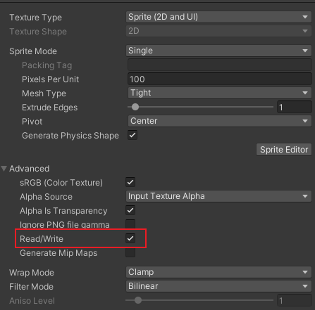

# 屏幕截图
### 方式一
Unity已经封装了全屏截图的接口，我们可以直接调用该接口
#### 接口原型
```csharp
// 接口原型
public static void CaptureScreenshot(string filename, int superSize)
```
其中，`filename`为截图文件的全路径名（路径+文件名+文件拓展名），`superSize`为分辨率增加的倍数，例如：如果`superSize`为4，那么实际的截图文件的宽高均是原分辨率的4倍，分辨率就是原来的16倍
#### 示例代码
```csharp
using UnityEngine;
using UnityEngine.UI;

public class UIMain : MonoBehaviour
{
    [SerializeField] private Button btnScreenShot;

    private void Awake()
    {
        btnScreenShot.onClick.AddListener(OnClickBtnScreenShot);
    }

    private void OnClickBtnScreenShot()
    {
        ScreenCapture.CaptureScreenshot("E:/ScreenShot.png"); // 在E盘保存屏幕截图为ScreenShot.png
    }
}
```
#### 注意
- 如果该文件已经存在，则会覆盖之前的文件
- 该方式的截图区域是整个屏幕区域，无法限定某个区域
---

### 方式二
如果我们想要只对游戏上的部分区域进行截图，那么上面的方式就无法实现我们的需求了，那么，我们可以使用下面的方式进行截图
#### 思路
Unity的Texture2D类，提供了从屏幕读取像素的接口，以及设置Texture2D像素颜色的接口，我们可以通过该类来实现
#### 示例代码
```csharp
using System;
using System.Collections;
using System.IO;
using UnityEngine;
using UnityEngine.UI;

public class UIMain : MonoBehaviour
{
    [SerializeField] private Button btnScreenShot; // 截图按钮

    private void Awake()
    {
        btnScreenShot.onClick.AddListener(OnClickBtnScreenShot);
    }

    private void OnClickBtnScreenShot()
    {
        StartCoroutine(ScreenShot());
    }

    // 截图协程
    IEnumerator ScreenShot()
    {
        yield return new WaitForEndOfFrame(); // 等待当前帧结束
        
        // 创建一个新的Texture2D用于保存屏幕内容，这里的大小使用了屏幕大小，如果只需要截取部分区域，调整参数即可
        Texture2D screenShot = new Texture2D(Screen.width, Screen.height, TextureFormat.RGB24, false);
        screenShot.ReadPixels(new Rect(0, 0, Screen.width, Screen.height), 0, 0); // 读取屏幕上的像素信息并设置到screenShot上
        
        // 这部分是添加水印，如果无此需求可以省略
        Texture2D logo = Resources.Load<Texture2D>("logo"); // 加载水印文件,这里加载的方式可以根据实际情况调整
        for (int i = 0; i < logo.width; i++)
        {
            for (int j = 0; j < logo.height; j++)
            {
                Color color = logo.GetPixel(i, j); // 获取水印的像素颜色
                screenShot.SetPixel(i, j, color); // 将颜色写到截图的对应像素
            }
        }

        screenShot.Apply(); // 实际应用对Texture2D的像素修改
        
        byte[] bytes = screenShot.EncodeToPNG(); // 按PNG格式编码为二进制流
        
        string fileName = "ScreenShot_" + DateTime.Now.ToString("yyyy-MM-dd_HH-mm-ss") + ".png"; // 文件名
        string path = Path.Combine("E:/", fileName); // 拼接路径
        File.WriteAllBytes(path, bytes); // 写入文件
        
        Destroy(screenShot); // 清理资源
        Destroy(logo);
    }
}
```

#### 注意
水印文件一定要开启“读写”权限，如果没有开启“读写”权限，读取水印文件时会导致报错


