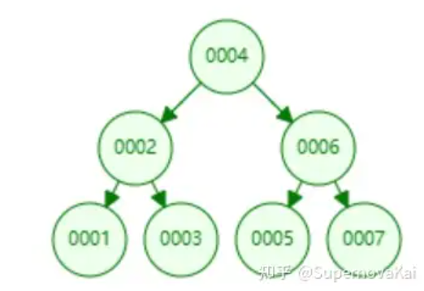

在前一篇文章中，详细讲了二叉搜索树，二叉搜索树可以以$O(log_2 n)$级别的时间复杂度实现对添加、删除以及查找元素的操作。

但是，这是理想的情况，下面我们解释在那种情况下，它并不是$O(log_2 n)$级别的。

------

### 问题

根据我们的规则，“左节点的值比根节点小，右节点的值比根节点大”，我们以“4 2 3 1 6 5 7”的顺序添加7个数据，我们得到的二叉树如下：

看上去没什么问题

那么，我现在以“1 2 3 4 5 6 7”的顺序添加元素呢，我们得到的二叉树是这样的：

这时，我们的二叉树已经“退化”成了一个链表，此时查找的操作，已经是O(n)级别的时间复杂度了，这种情况叫做“二叉树失衡”。

这时，我们需要在二叉搜索树的基础上进行改进，我们引入一种新的二叉树，**AVL树。**
