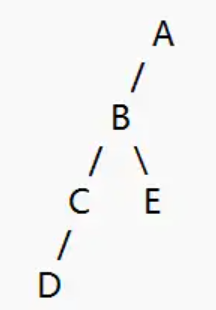
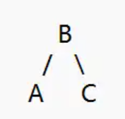
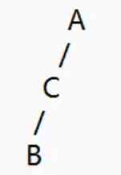

上一篇文章中，提到了二叉搜索树存在某些情况下（比如插入有序数据），会退化为链表的情况，使得操作的时间复杂度变为O(n)，而AVL树通过保持二叉树的平衡性，确保操作的时间复杂度始终为$O(log_2 n)$。

下面，我们先引入几个概念

------

### 节点高度

**空节点的高度为0**

**叶子节点（即没有任何子节点的末端节点，可以理解为终点）的高度为1**

**某个节点的高度 = 其左子节点与其右子节点高度的较大值 + 1**

我们也可以使用下面的公式来计算节点高度：
$$
height(node) = max(height(node.left), height(node.right)) + 1
$$


以上面的图为例

D、E均是“叶子节点，它们的高度均是1

C的高度是2

B的高度是3

A的高度是4

------

### 树的高度

有时，还有一种说法，叫“树的高度”，“树的高度“其实就是这颗”树“的根节点的高度，只是表达上的一种不同叫法而已，比如上图中，A的左子树高度，那么就是A的左子树的根节点，也就是B的高度。

**树的高度 = 这颗树的根节点的高度**

------

### 平衡因子

平衡因子是”**某个节点的左子树高度减去右子树高度“**的差值x

即，**某个节点的平衡因子 = 左子树的高度 - 右子树的高度**

还是以开头的二叉树为例子，

A的平衡因子 = 左子树的高度 - 右子树的高度 = 左子节点的高度 - 右子节点的高度（左子节点B的高度是3，没有右子节点，那么右子节点的高度就是0） = 3 - 0 = 3

------

### AVL树规则

AVL树其实就是在二叉搜索树的基础上，通过规则实现自平衡，防止失衡的一种二叉搜索树的变体

理解了平衡因子之后，我们来看看AVL树的规则，“**每个节点的平衡因子只能是-1、0或+1，如果任何节点的平衡因子绝对值大于1，则树不平衡**”

下面我们介绍一共四种失衡情况及其处理方法

------

### 左左失衡（LL失衡）

适用于：左子树比右子树的高度超过1层（平衡因子大于+1），并且左子树的左子树更高（左左情况）


还是以这个二叉树为例，我们刚才已经计算出，A的平衡因子是3，并且是左左情况，我们需要对A节点进行右旋转来保持平衡

右旋转步骤如下：

1. 将B提升到A的位置，成为新的根节点
2. A成为B的右子节点（B原本就是A的左子节点，那么B肯定比A小，A肯定比B大，可以放到B的右子树）
3. B的右子树（如果有），成为A的左子树（根据二叉搜索树规则，B的右子树的所有值肯定比B大，但是B又是A的左子节点，A肯定比B大，那么B的右子树的值就是肯定比A小的，所以B的右子树可以放到A的左子树）

调整后的二叉树如下：


**右旋转代码如下**

```csharp
//右旋转,node为失衡的节点
private TreeNode RightRotate(TreeNode node)
{
    TreeNode left = node.Left; //左子节点
    TreeNode left_right = left.Right; //左子节点的右子树
    left.Right = node; //左子节点的右子节点修改为原根节点
    node.Left = left_right; //左子节点的右子树，成为原根节点的左子树
    return left; //返回左子节点，在外部替换原来的根节点
}
```

------

### 右右失衡（RR失衡）

适用于：右子树比左子树的高度超过1层（平衡因子小于-1），并且右子树的右子树更高（右右情况）


与右右失衡类似，我们要让这个二叉树保持平衡，只需要将A左旋转即可，步骤如下：

1. 将B提升到A的位置，成为新的根节点
2. A成为B的左子树
3. B的左子树（如果有），成为A的右子树

调整后的二叉树如下：



**左旋转代码如下**

```csharp
//左旋转,node为失衡的节点
private TreeNode LeftRotate(TreeNode node)
{
    TreeNode right = node.Right; //右子节点
    TreeNode right_left = right.Left; //右节点的左子树
    right.Left = node;
    node.Right = right_left;
    return right;
}
```

------

### 左右失衡（LR失衡）


这种情况需要分为两步：

1. 先对B进行左旋转（左旋之后便将问题转换为LL失衡了）



2.再对A进行右旋转


------

### 右左失衡（RL失衡）


与左右失衡类似，需要两步操作

1. 先对B进行右旋转
2. 再对A进行左旋转

------

**总结如下：**

- LL和RR失衡，都是直线型失衡，只需要对失衡的根节点进行一次相反方向的旋转即可（LL就是二叉树偏向左边失衡，只需要右旋转一次即可恢复平衡）
- LR和RL是折线型失衡，比如，LR代表根节点偏向左子树失衡，左子树又偏向它的右子树失衡，所以我们需要先对失衡的根节点的左子树进行一次左旋转，那么我们便将问题转化为LL失衡，这时再对根节点进行一次右旋转便可以恢复平衡
- LL -> 对失衡节点进行一次右旋转
- RR -> 对失衡节点进行一次左旋转
- LR -> 先对失衡节点的左子节点进行左旋，再对根节点进行一次右旋
- RL -> 先对失衡节点的右子节点进行右旋，再对根节点进行一次左旋

------

对之前的二叉搜索树添加一些代码，便可实现AVL树

1.每个节点新增高度属性

```csharp
public int Height { get; set; } //节点高度
```

2.获取节点高度、计算平衡因子、计算节点高度的方法

```csharp
// 获取节点高度
private int GetHeight(TreeNode node)
{
    return node == null ? 0 : node.Height;
}

// 计算平衡因子
private int GetBalanceFactor(TreeNode node)
{
    if (node == null)
        return 0;
    return GetHeight(node.Left) - GetHeight(node.Right);
}

// 更新节点高度
private void UpdateHeight(TreeNode node)
{
    node.Height = 1 + Math.Max(GetHeight(node.Left), GetHeight(node.Right));
}
```

3.新增节点右旋转、左旋转的方法

```csharp
//右旋转,node为失衡的节点
private TreeNode RightRotate(TreeNode node)
{
    TreeNode left = node.Left; //左子节点
    TreeNode left_right = left.Right; //左子节点的右子树
    left.Right = node; //左子节点的右子节点修改为原根节点
    node.Left = left_right; //左子节点的右子树，成为原根节点的左子树
    // 更新高度
    UpdateHeight(node);
    UpdateHeight(left);
    return left; //返回左子节点，在外部替换原来的根节点
}

//左旋转,node为失衡的节点
private TreeNode LeftRotate(TreeNode node)
{
    TreeNode right = node.Right; //右子节点
    TreeNode right_left = right.Left; //右节点的左子树
    right.Left = node;
    node.Right = right_left;
    // 更新高度
    UpdateHeight(node);
    UpdateHeight(right);
    return right;
}
```

4.在完成原来的插入、删除流程之后，进行一次平衡因子检查，并对四种失衡情况进行处理

------

**完整代码**

```csharp
public class AVLTree
{
    //节点类
    private class TreeNode
    {
        public int Data { get; set; } //数据
        public TreeNode Left { get; set; } //左子节点
        public TreeNode Right { get; set; } //右子节点
        public int Height { get; set; } //节点高度

        public TreeNode(int data)
        {
            Data = data;
            Left = null;
            Right = null;
            Height = 1;
        }
    }

    private TreeNode root; //根节点

    public AVLTree()
    {
        root = null;
    }

    // 获取节点高度
    private int GetHeight(TreeNode node)
    {
        return node == null ? 0 : node.Height;
    }

    // 计算平衡因子
    private int GetBalanceFactor(TreeNode node)
    {
        if (node == null)
            return 0;
        return GetHeight(node.Left) - GetHeight(node.Right);
    }

    // 更新节点高度
    private void UpdateHeight(TreeNode node)
    {
        node.Height = 1 + Math.Max(GetHeight(node.Left), GetHeight(node.Right));
    }

    //右旋转,node为失衡的节点
    private TreeNode RightRotate(TreeNode node)
    {
        TreeNode left = node.Left; //左子节点
        TreeNode left_right = left.Right; //左子节点的右子树
        left.Right = node; //左子节点的右子节点修改为原根节点
        node.Left = left_right; //左子节点的右子树，成为原根节点的左子树
        // 更新高度
        UpdateHeight(node);
        UpdateHeight(left);
        return left; //返回左子节点，在外部替换原来的根节点
    }

    //左旋转,node为失衡的节点
    private TreeNode LeftRotate(TreeNode node)
    {
        TreeNode right = node.Right; //右子节点
        TreeNode right_left = right.Left; //右节点的左子树
        right.Left = node;
        node.Right = right_left;
        // 更新高度
        UpdateHeight(node);
        UpdateHeight(right);
        return right;
    }

    public void Insert(int data)
    {
        root = InsertNode(root, data);
    }

    private TreeNode InsertNode(TreeNode node, int data)
    {
        if (node == null) //如果根节点为空
        {
            node = new TreeNode(data); //初始化根节点
            return node;
        }

        if (data < node.Data) //比根节点的值小
        {
            node.Left = InsertNode(node.Left, data); //插入到左边
        }
        else if (data > node.Data) //比根节点的值大
        {
            node.Right = InsertNode(node.Right, data); //插入到右边
        }
        else //遇到重复值直接返回，不允许重复值
        {
            return node;
        }
        
        //更新节点高度
        UpdateHeight(node);

        //计算平衡因子
        int balance = GetBalanceFactor(node);

        // 如果不平衡，有4种情况

        // 左左情况
        if (balance > 1 && data < node.Left.Data)
            return RightRotate(node);

        // 右右情况
        if (balance < -1 && data > node.Right.Data)
            return LeftRotate(node);

        // 左右情况
        if (balance > 1 && data > node.Left.Data)
        {
            node.Left = LeftRotate(node.Left);
            return RightRotate(node);
        }

        // 右左情况
        if (balance < -1 && data < node.Right.Data)
        {
            node.Right = RightRotate(node.Right);
            return LeftRotate(node);
        }

        // 如果已经平衡，返回节点
        return node;

    }

    public bool Contains(int data)
    {
        return ContainsNode(root, data);
    }

    private bool ContainsNode(TreeNode node, int data)
    {
        if (node == null)
            return false;

        if (data < node.Data)
            return ContainsNode(node.Left, data);
        else if (data > node.Data)
            return ContainsNode(node.Right, data);
        else
            return true;
    }

    public void Delete(int data)
    {
        root = DeleteNode(root, data);
    }

    private TreeNode DeleteNode(TreeNode node, int data)
    {
        if (node == null)
            return node;

        if (data < node.Data)
        {
            node.Left = DeleteNode(node.Left, data);
        }
        else if (data > node.Data)
        {
            node.Right = DeleteNode(node.Right, data);
        }
        else
        {
            if (node.Left == null) //节点只有右节点
            {
                return node.Right;
            }
            else if (node.Right == null) //节点只有左节点
            {
                return node.Left;
            }

            // 节点有两个子节点：获取右子树的最小值
            node.Data = MinValue(node.Right);

            // 删除右子树的最小值
            node.Right = DeleteNode(node.Right, node.Data);
        }

        // 更新节点高度
        UpdateHeight(node);

        //获取平衡因子检查是否平衡
        int balance = GetBalanceFactor(node);

        // 如果不平衡，有4种情况

        // 左左情况
        if (balance > 1 && GetBalanceFactor(node.Left) >= 0)
            return RightRotate(node);

        // 左右情况
        if (balance > 1 && GetBalanceFactor(node.Left) < 0)
        {
            node.Left = LeftRotate(node.Left);
            return RightRotate(node);
        }
        // 右右情况
        if (balance < -1 && GetBalanceFactor(node.Right) <= 0)
            return LeftRotate(node);

        // 右左情况
        if (balance < -1 && GetBalanceFactor(node.Right) > 0)
        {
            node.Right = RightRotate(node.Right);
            return LeftRotate(node);
        }

        return node;
    }

    private int MinValue(TreeNode node)
    {
        int minValue = node.Data;
        while (node.Left != null)
        {
            minValue = node.Left.Data;
            node = node.Left;
        }
        return minValue;
    }

    /// <summary>
    /// 前序遍历
    /// </summary>
    public void PreOrder()
    {
        PreOrderNode(root);
    }

    private void PreOrderNode(TreeNode node)
    {
        if (node == null)
            return;
        Console.Write(node.Data + " ");
        PreOrderNode(node.Left);
        PreOrderNode(node.Right);
    }

    /// <summary>
    /// 中序遍历
    /// </summary>
    public void InOrder()
    {
        InOrderNode(root);
    }

    private void InOrderNode(TreeNode node)
    {
        if (node == null)
            return;
        InOrderNode(node.Left);
        Console.Write(node.Data + " ");
        InOrderNode(node.Right);
    }

    /// <summary>
    /// 后序遍历
    /// </summary>
    public void PostOrder()
    {
        PostOrderNode(root);
        Console.WriteLine();
    }

    private void PostOrderNode(TreeNode node)
    {
        if (node == null)
            return;
        PostOrderNode(node.Left);
        PostOrderNode(node.Right);
        Console.Write(node.Data + " ");
    }

    /// <summary>
    /// 层序遍历
    /// </summary>
    public void LevelOrder()
    {
        if (root == null)
            return; // 空树直接返回

        Queue<TreeNode> queue = new Queue<TreeNode>();
        queue.Enqueue(root); // 根节点入队

        while (queue.Count > 0) // 队列不为空时循环
        {
            TreeNode current = queue.Dequeue(); // 取出队首节点
            Console.Write(current.Data + " "); // 访问该节点

            // 将当前节点的左子节点入队（如果存在）
            if (current.Left != null)
                queue.Enqueue(current.Left);

            // 将当前节点的右子节点入队（如果存在）
            if (current.Right != null)
                queue.Enqueue(current.Right);
        }
        Console.WriteLine();
    }
}
```