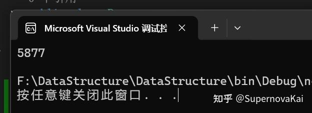

### 之前写法的问题

未优化的代码：

```csharp
public static void BubbleSort(int[] array)
{
    for (int i = 0; i < array.Length - 1; i++)
    {
        for (int j = 0; j < array.Length - 1 - i; j++)
        {
            if (array[j + 1] < array[j])
            {
                int temp = array[j + 1];
                array[j + 1] = array[j];
                array[j] = temp;
            }
        }
    }
}
```

这里有一个问题，如果在执行循环的过程中，已经将数组排好序了，比如：我有一个集合的长度是5，只有前两个元素的顺序是反的，像下面这样

```csharp
int[] array = new int[5]{ 2,1,3,4,5 }
```

那么当我第一轮排序结束时，2和1就会交换位置，此时集合已经是完全有序的了，就没有必须走后面几轮了，我们可以让外层的循环提前终止来提高代码的性能

------

### 先测试一下优化之前的代码

写一段代码测试一下，我们直接取最极端的情况，集合本身就是完全有序的

```csharp
public static void BubbleTest()
{
    int[] array = new int[100000];
    for (int i = 0; i < array.Length; i++)
    {
        array[i] = i;
    }

    Stopwatch sw = new Stopwatch();
    sw.Start();
    Sort.BubbleSort(array);
    sw.Stop();

    Console.WriteLine(sw.ElapsedMilliseconds);
}
```

测试结果如下：



对于一个长度为100000，但是本身完全有序的集合，我们仍然花费了5877毫秒进行排序，显然这是不合理的。

------

### 优化代码

其实很简单，**如果有某一轮，我们内层循环没有进行过任何一次交换**，那么就说明，集合本身已经是完全有序的了，我们只需要额外添加一个变量用来标记本轮是否进行过交换便可以了。

修改代码如下

```csharp
public static void BubbleSort(int[] array)
{
    for (int i = 0; i < array.Length - 1; i++)
    {
        bool swapped = false;  // 标记本轮是否发生过交换
        for (int j = 0; j < array.Length - 1 - i; j++)
        {
            if (array[j + 1] < array[j])
            {
                int temp = array[j + 1];
                array[j + 1] = array[j];
                array[j] = temp;
                swapped = true;  // 发生了交换，标记改为 true
            }
        }

        if (!swapped)  // 如果本轮没有交换，说明数组已经有序，提前结束
        {
            break;
        }
    }
}
```

这一次用之前的数据重新测试


这一次只花了0毫秒，这是因为我们的数据是完全有序的，第一轮的时候，就没有发生过任何交换，于是外层循环就break出来了