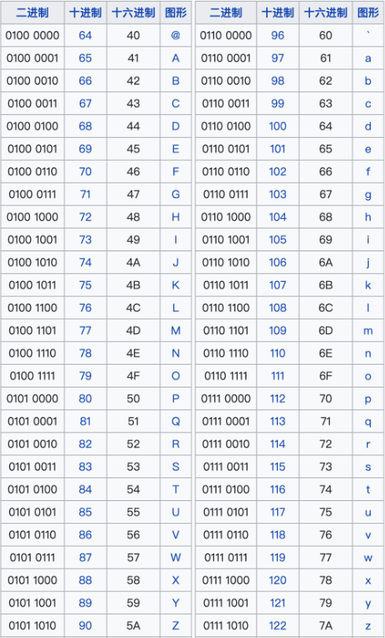

# 字母位运算技巧
### 前言
首先，我们先看看26个字母的ASCII码值



我们可以发现，**在二进制下，对于任意字母，其大写和小写形式的字符，其ASCII码只有第三位不同**，大写的是`0`，小写的是`1`

换一种形式说，任意字母的大写和小写，其ASCII码值，都只相差一个`0b0010 0000`，也就是十进制下的`32`

这样设计是有原因的，由于字母的大小写转换是高频操作，这样设计保证了，进行大小写转换时，只有一个比特位需要修改，最大化提高了性能

### 使用技巧
有了这一特性，我们便可以使用位运算进行部分操作了，示例如下：
```csharp
c ^= 32; // 大写转小写，小写转大写
c ^= 0b00100000; // char类型只有8位，也可以使用二进制(相当于对倒数第五位进行异或，1变0，0变1)

c |= 32; // 大写变小写，小写不变

c &= ~32; // 大写不变，小写变大写

```
